Welcome to a power-packed module where concepts meet code!


In this stage of your Redux Reaper journey, we’re not just talking theory — we’re building. You’ll solidify your understanding of functional programming, dive into mutation control, and unlock advanced techniques like currying and Redux middleware.


Then we take it further — by combining Redux logic with modern UI tooling using Shadcn UI, React Router, and real-world component architecture. From creating modals, card views, and dark mode, to wiring up the Redux store with selector functions — this is where it all comes together.

By the end of this module, you'll see how clean architecture, functional programming, and scalable state management merge into a professional-grade UI.
## 22-1 Basics of Functional Programming.
- 1 we are use in redux pure function because redux maintain pure function in reducer = same input same output
- 2 we are avoid impure function
```js
//=================================  Pure Function ============================= ===
// same input same output
const add = (a,b)=> a + b;
console.log(add(1,4))
console.log(add(1,4))
console.log(add(1,4))
// =========================== impure Function =================================
let total = 0;// global function 
const addTotal = (amount)=>(total= total+ amount)
console.log(addTotal(4))
// this is also impure function because every second he update it
const updateDate = () =>{
    new Date();
}

const randomNumber = (amount)=>{
return amount + Math.random()
}
console.log(randomNumber(3))
console.log(randomNumber(3))
console.log(randomNumber(3))
console.log(randomNumber(3))
```
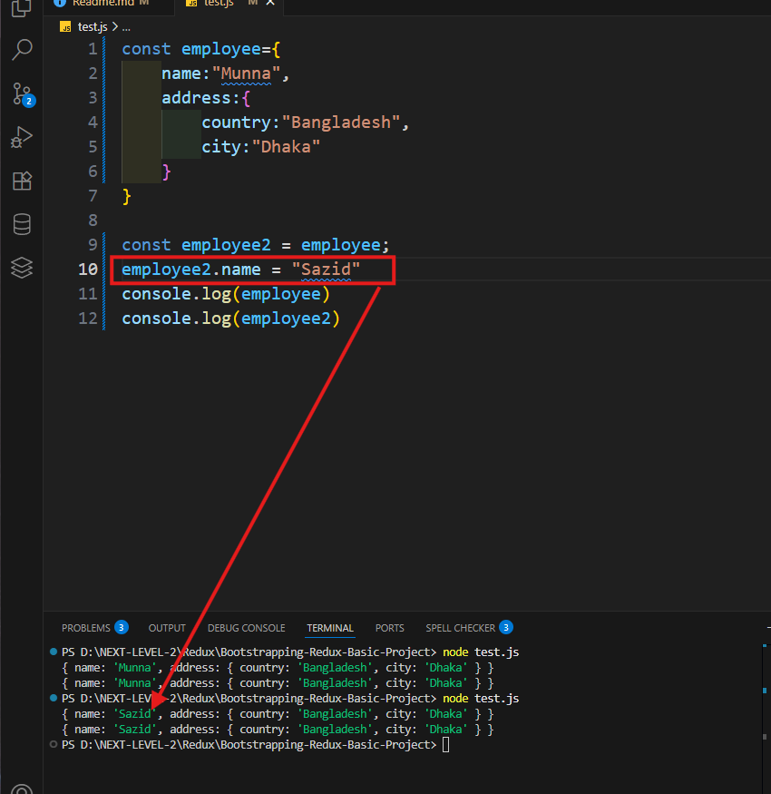

## 22-2 Understanding mutation and ways to avoid it.
- mutation mean change to  real situation

- the problem is when i update employee2.name also update employee name
```js
const employee={
    name:"Munna",
    address:{
        country:"Bangladesh",
        city:"Dhaka"
    }
}

const employee2 = employee;
employee2.name = "Sazid"
console.log(employee)
console.log(employee2)
//{ name: 'Sazid', address: { country: 'Bangladesh', city: 'Dhaka' } }
//{name: 'Sazid', address: { country: 'Bangladesh', city: 'Dhaka' } }
```
- solution is spread operator
```js
const employee={
    name:"Munna",
    address:{
        country:"Bangladesh",
        city:"Dhaka"
    }
}


const employee2={
...employee,
name:"sazid",

}
console.log(employee)
console.log(employee2)
// { name: 'Munna', address: { country: 'Bangladesh', city: 'Dhaka' } }
// { name: 'sazid', address: { country: 'Bangladesh', city: 'Dhaka' } }
```
- data mutation problem
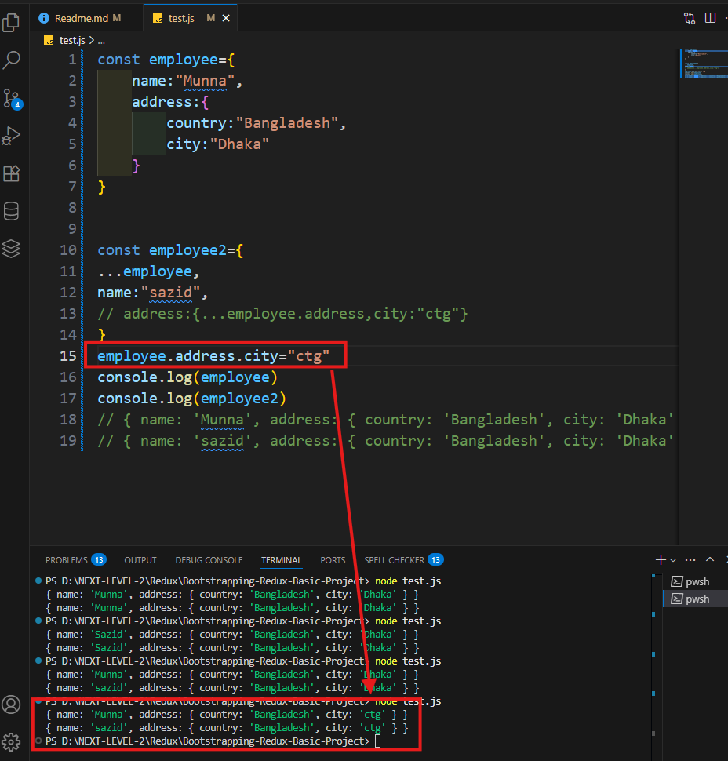
- solution 
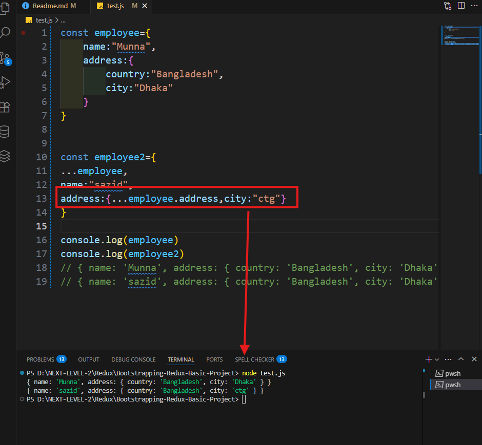 
- redux behind the seen use immer for manage mutation
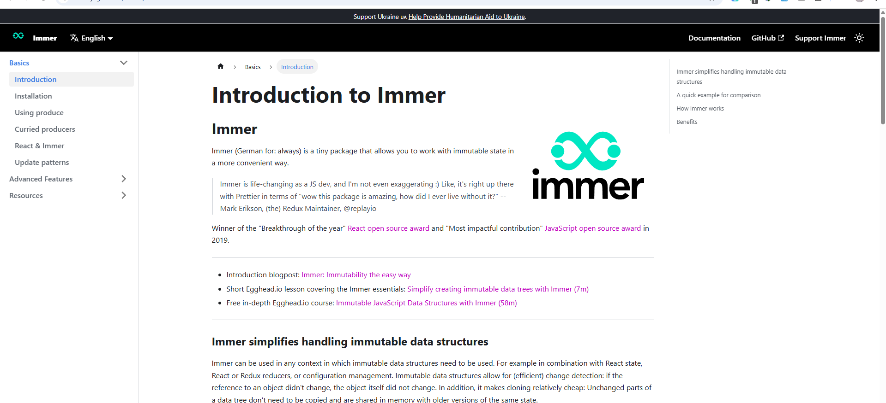
```js
import {produce} from "immer"
const employee={
    name:"Munna",
    address:{
        country:"Bangladesh",
        city:"Dhaka"
    }
}


const employee2=produce(employee,draft=>{
    draft.name="sollu"
})
console.log(employee)
console.log(employee2)
```
## 22-3 Function Currying

```js
//currying/ function curry

// Normal Function
// const add = (a, b) => a + b;

// curried
const add = (a) =>(b)=> a + b;
```
- problem maximum time call output
```js
// normal function
const totalPrice = (amount,discount)=> amount - amount * discount;


console.log(totalPrice(100,0.3))
console.log(totalPrice(300,0.3))
console.log(totalPrice(500,0.3))
// curring function
const totalPrice = (discount) => (amount) => amount - amount * discount;

const withDiscount = totalPrice(0.3)
console.log(withDiscount(100))
console.log(withDiscount(200))

```

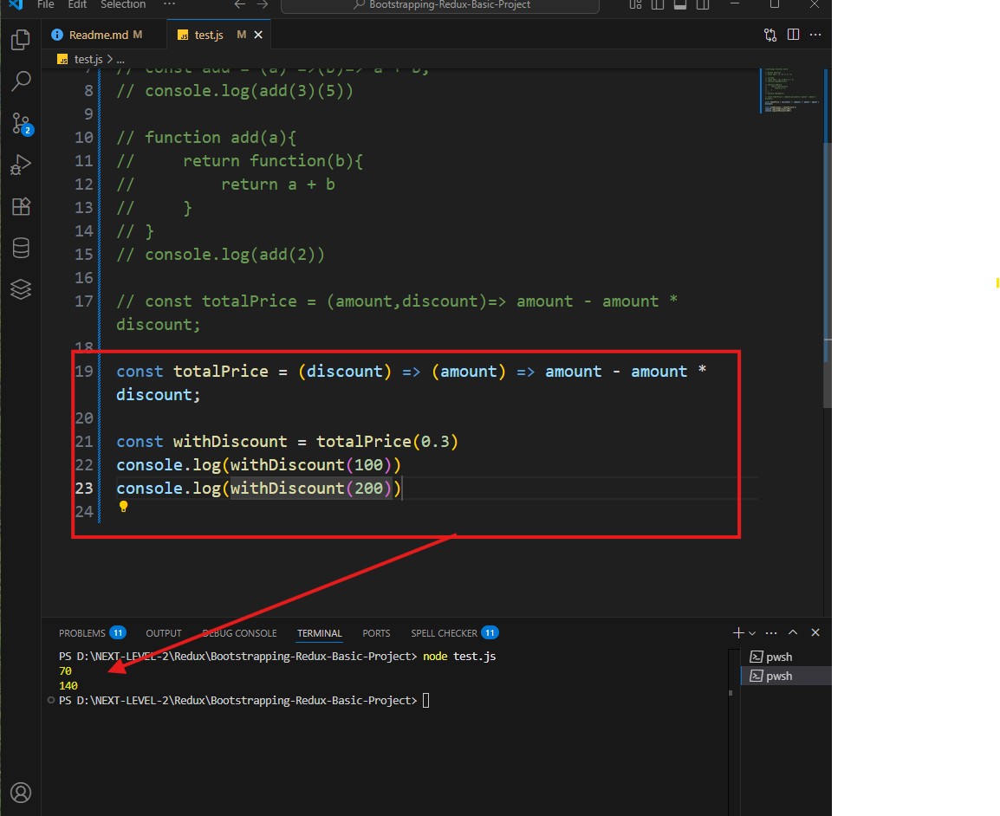

## 22-4 Redux middleware basics
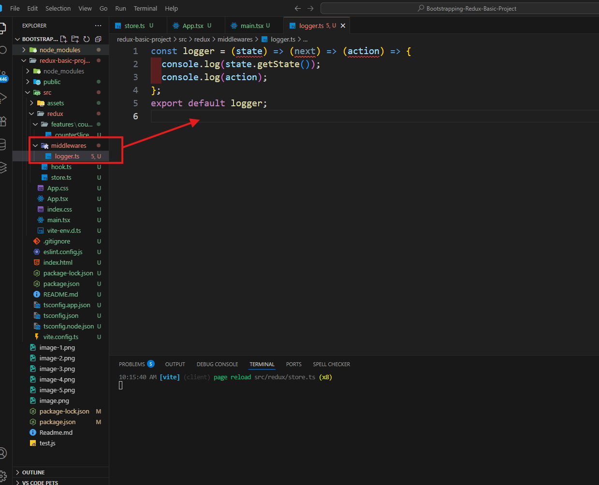
- middleware redux by default some middleware add in there project and i am also add my logger middleware
```js

import { configureStore } from "@reduxjs/toolkit";
import counterReducer from "./features/counter/counterSlice"
import logger from "./middlewares/logger";
export const store = configureStore({
  reducer: {
    counter:counterReducer
  },
middleware:(getDefaultMiddleware)=>getDefaultMiddleware().concat(logger)
});

export type RootState =ReturnType<typeof store.getState>;
export type AppDispatch =typeof store.dispatch;
```
you custom create logger Middleware for Debugging and others check

```js
const logger = (state) => (next) => (action) => {
  console.group(action.type);
  console.log("prev state",state.getState());
  const result = next(action);
  console.log("Next State",state.getState())
  console.groupEnd()
  return result
};
export default logger;
```
## 22-5 Initializing Shadcn UI
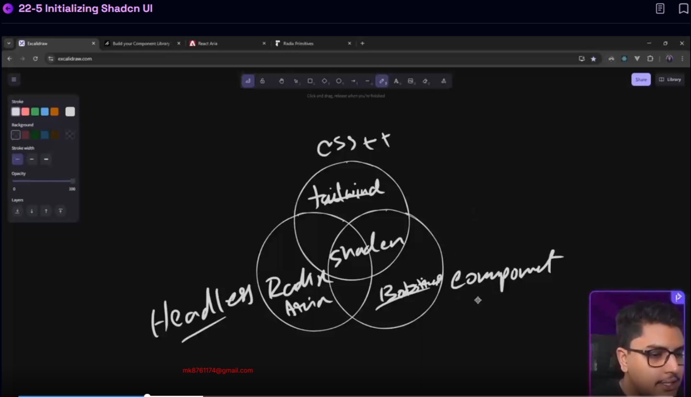
https://ui.shadcn.com/docs/installation/vite

 follow shadcn official Document for installation

## 22-6 Configure basic routing using react-router-dom
 we are react router dom Data
 **1 step**  
 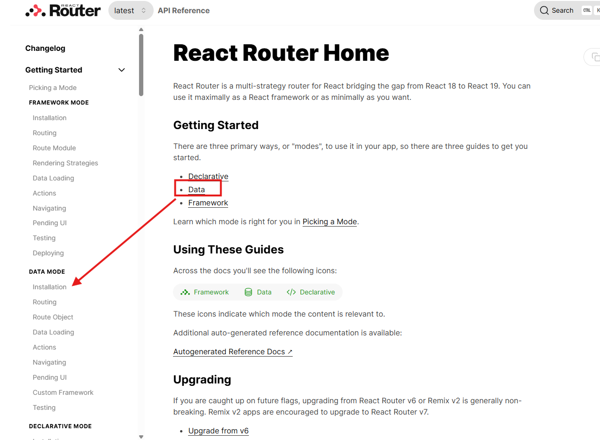
 **2 step**  
 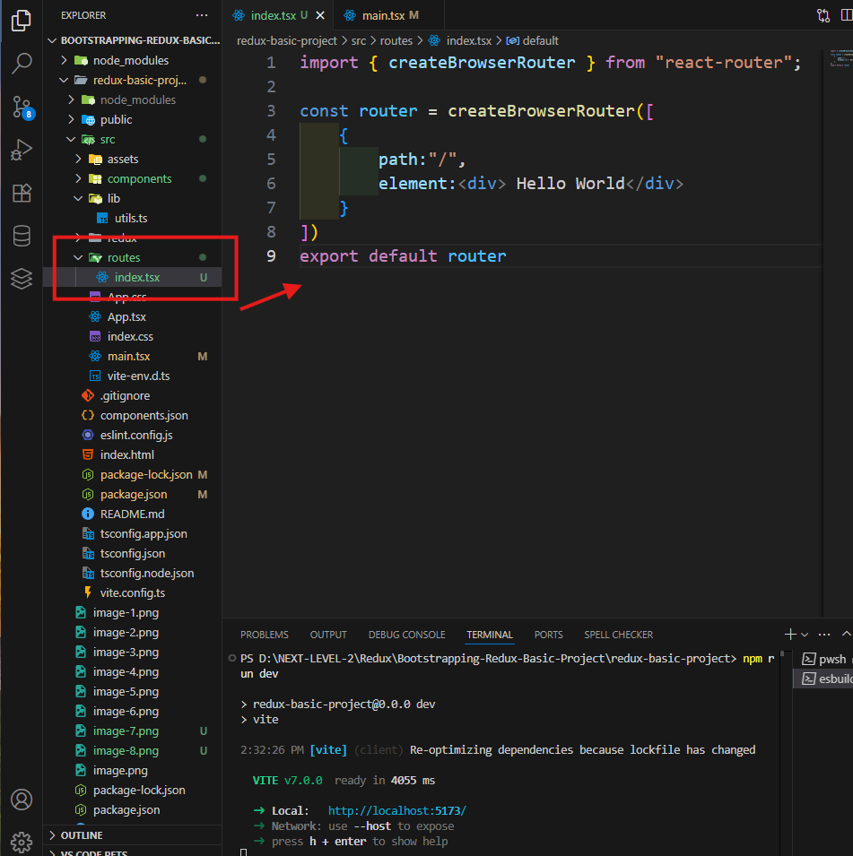
  **3 step**  
 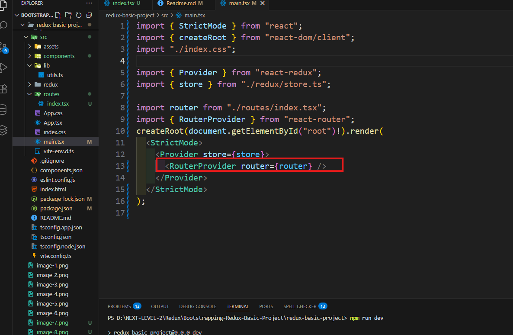
 if i add in index true he is by default show this page when i open main server
 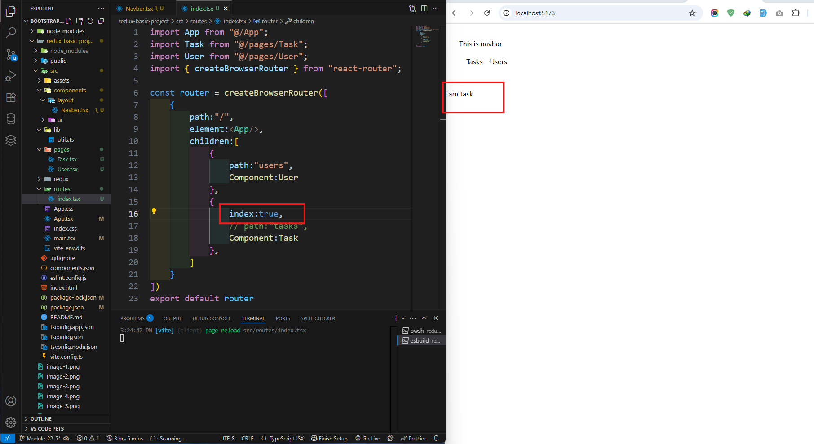

path Handeling

 ```js
 import App from "@/App";
import Task from "@/pages/Task";
import User from "@/pages/User";
import { createBrowserRouter } from "react-router";

const router = createBrowserRouter([
    {
        path:"/",
        element:<App/>,
        children:[
            {
                path:"users",
                Component:User
            },
            {
                index:true,
                // path:"tasks",
                Component:Task
            },
            {
                
                path:"tasks",
                Component:Task
            },
        ]
    }
])
export default router
```
Route Render
```js
import React from 'react'
import { Link } from 'react-router'

export default function Navbar() {
  return (
    <div className='p-8'>
     <div> This is navbar</div>
      <button className='p-4'><Link to="/tasks">Tasks</Link></button>
      <button><Link to="/users">Users</Link></button>
    </div>
  )
}

```

path children call

```js
import { Outlet } from "react-router"
import Navbar from "./components/layout/Navbar"


const App = () => {
  return (
    <div>
      <Navbar></Navbar>
      <Outlet></Outlet>
    </div>
  )
}

export default App
```

## 22-7 Handel dark mode using shadcn
- src -> providers -> theme-provider.tsx

```tsx
import { createContext, useContext, useEffect, useState } from "react"

type Theme = "dark" | "light" | "system"

type ThemeProviderProps = {
    children: React.ReactNode
    defaultTheme?: Theme
    storageKey?: string
}

type ThemeProviderState = {
    theme: Theme
    setTheme: (theme: Theme) => void
}

const initialState: ThemeProviderState = {
    theme: "system",
    setTheme: () => null,
}

const ThemeProviderContext = createContext<ThemeProviderState>(initialState)

export function ThemeProvider({
    children,
    defaultTheme = "system",
    storageKey = "vite-ui-theme",
    ...props
}: ThemeProviderProps) {
    const [theme, setTheme] = useState<Theme>(
        () => (localStorage.getItem(storageKey) as Theme) || defaultTheme
    )

    useEffect(() => {
        const root = window.document.documentElement

        root.classList.remove("light", "dark")

        if (theme === "system") {
            const systemTheme = window.matchMedia("(prefers-color-scheme: dark)")
                .matches
                ? "dark"
                : "light"

            root.classList.add(systemTheme)
            return
        }

        root.classList.add(theme)
    }, [theme])

    const value = {
        theme,
        setTheme: (theme: Theme) => {
            localStorage.setItem(storageKey, theme)
            setTheme(theme)
        },
    }

    return (
        <ThemeProviderContext.Provider {...props} value={value}>
            {children}
        </ThemeProviderContext.Provider>
    )
}

export const useTheme = () => {
    const context = useContext(ThemeProviderContext)

    if (context === undefined)
        throw new Error("useTheme must be used within a ThemeProvider")

    return context
}
```
- main.tsx

```tsx
import { StrictMode } from 'react'
import { createRoot } from 'react-dom/client'
import './index.css'
import { RouterProvider } from 'react-router'
import router from './routes/index.tsx'
import { Provider } from 'react-redux'
import { store } from './redux/store.ts'
import { ThemeProvider } from './providers/theme-provider.tsx'

createRoot(document.getElementById('root')!).render(
  <StrictMode>
    <ThemeProvider defaultTheme='dark' storageKey='vite-ui-theme'>
      <Provider store={store}>
        <RouterProvider router={router} />
      </Provider>
    </ThemeProvider>
  </StrictMode>,
)

```

- Install dropdown menu

```
npx shadcn@latest add dropdown-menu
```
- Add mode toggler src -> components -> theme-toggler.tsx

```tsx
import { Moon, Sun } from "lucide-react"

import { Button } from "@/components/ui/button"
import {
    DropdownMenu,
    DropdownMenuContent,
    DropdownMenuItem,
    DropdownMenuTrigger,
} from "@/components/ui/dropdown-menu"
import { useTheme } from "@/providers/theme-provider"


export function ModeToggle() {
    const { setTheme } = useTheme()

    return (
        <DropdownMenu>
            <DropdownMenuTrigger asChild>
                <Button variant="outline" size="icon">
                    <Sun className="h-[1.2rem] w-[1.2rem] scale-100 rotate-0 transition-all dark:scale-0 dark:-rotate-90" />
                    <Moon className="absolute h-[1.2rem] w-[1.2rem] scale-0 rotate-90 transition-all dark:scale-100 dark:rotate-0" />
                    <span className="sr-only">Toggle theme</span>
                </Button>
            </DropdownMenuTrigger>
            <DropdownMenuContent align="end">
                <DropdownMenuItem onClick={() => setTheme("light")}>
                    Light
                </DropdownMenuItem>
                <DropdownMenuItem onClick={() => setTheme("dark")}>
                    Dark
                </DropdownMenuItem>
                <DropdownMenuItem onClick={() => setTheme("system")}>
                    System
                </DropdownMenuItem>
            </DropdownMenuContent>
        </DropdownMenu>
    )
}
```

- Navbar.tsx

```tsx
import Logo from "@/assets/Logo";
import { Link } from "react-router";
import { ModeToggle } from "../mode-toggler";

export default function Navbar() {
    return (
        <div>
            <nav className="max-w-7xl mx-auto h-16 flex items-center justify-between gap-3 px-5">
                <div className="flex items-center">
                    <Logo /> <span className="font-bold ml-2">Task</span> Master
                </div>

                <Link to="/users">Users</Link>
                <Link to="/tasks">Tasks</Link>

                <div className="ml-auto">
                    <ModeToggle />
                </div>
            </nav>

        </div>
    )
}

```
## 22-8 Initiate todo slice and initial state.
- src -> types.ts

```ts
export interface ITask {
    id: string
    title: string
    description: string
    dueDate: string
    isCompleted: boolean
    priority: "High" | "Medium" | "Low"
}
```

- taskSlice.ts 

```ts 
import type { ITask } from "@/types";
import { createSlice } from "@reduxjs/toolkit";

// make a type 

interface InitialState {
    tasks: ITask[]
}
// this is giving a vibe of schema. 
const initialState: InitialState = {
    tasks: [
        {
            id: "dskdjsdks",
            title: "Initialize Frontend",
            description: "Create Homepage and Routing",
            dueDate: "2025-11",
            isCompleted: false,
            priority: "High"
        },
        {
            id: "euryeur",
            title: "Create Github Repo",
            description: "Make the proper commits ",
            dueDate: "2025-11",
            isCompleted: false,
            priority: "High"
        }
    ]
}
const taskSlice = createSlice({
    name: "task",
    initialState,
    reducers: {}
})

export default taskSlice.reducer


```

- store.ts 

```ts 
import { configureStore } from '@reduxjs/toolkit'
import counterReducer from "./features/counter/counterSlice"

import taskReducer from "./features/task/taskSlice"

export const store = configureStore({
    reducer: {
        counter: counterReducer,
        todo: taskReducer
    }
})

export type RootState = ReturnType<typeof store.getState>

export type AppDispatch = typeof store.dispatch

```
## 22-9 create “Selector Functions” for better modularity
- taskSlice.ts 

```ts
import type { RootState } from "@/redux/store";
import type { ITask } from "@/types";
import { createSlice } from "@reduxjs/toolkit";


// make a type 

interface InitialState {
    tasks: ITask[],
    filter: "all" | "high" | "medium" | "low"
}
// this is giving a vibe of schema. 
const initialState: InitialState = {
    tasks: [
        {
            id: "dskdjsdks",
            title: "Initialize Frontend",
            description: "Create Homepage and Routing",
            dueDate: "2025-11",
            isCompleted: false,
            priority: "High"
        },
        {
            id: "euryeur",
            title: "Create Github Repo",
            description: "Make the proper commits ",
            dueDate: "2025-11",
            isCompleted: false,
            priority: "High"
        },
    ],
    filter: "all",
}
const taskSlice = createSlice({
    name: "task",
    initialState,
    reducers: {}
})

export const selectTasks = (state: RootState) => {
    return state.todo.tasks
}
export const selectFilter = (state: RootState) => {
    return state.todo.filter
}

export default taskSlice.reducer


```

- this makes the grabbing tasks and filter modular
- tasks.tsx
```tsx
import { selectFilter, selectTasks } from "@/redux/features/task/taskSlice"
import { useAppSelector } from "@/redux/hooks"

export default function Task() {
    // const tasks = useAppSelector((state) => state.todo.tasks)

    // we can do this more efficient way by grabbing the tasks inside task slice

    const tasks = useAppSelector(selectTasks)
    const filter = useAppSelector(selectFilter)

    console.log(tasks)
    console.log(filter)


    return (
        <div>
            <h1>This is Task Component</h1>
        </div>
    )
}

```
